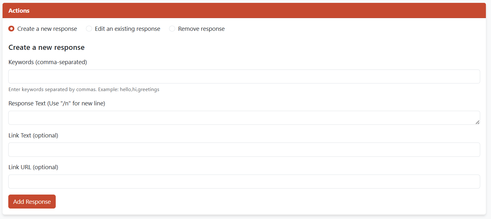

# AI e-Aushadhi and e-Upkaran Chat-bot Assistant

A Spring Framework-based intelligent chatbot system designed to provide support for e-Aushadhi and e-Upkaran services. This application features a real-time chat interface, administrative dashboards, and comprehensive query logging.

## 📋 Overview

This chatbot assistant is built using Java Spring Framework with a multi-tier architecture that separates presentation, business logic, and data persistence. It uses WebSockets for real-time communication and incorporates voice recognition capabilities for an enhanced user experience.

## ✨ Features

### End-User Features
- Interactive chat interface with text and voice input options
- Real-time response generation based on keyword matching
- Voice-to-text functionality using Web Speech API
- Responsive and draggable chat window

### Administrative Features
- Comprehensive CRUD operations for managing chatbot responses
- Intuitive admin dashboard for knowledge base management
- Query log analytics dashboard with search and filtering capabilities
- Statistical overview of user interactions

## 🛠️ Technology Stack

### Backend
- **Framework**: Java Spring Boot
- **Data Persistence**: Spring Data JPA & Hibernate
- **Database**: MySQL
- **Real-time Communication**: WebSocket & STOMP protocol

### Frontend
- **Templating Engine**: Thymeleaf
- **Core Technologies**: HTML5, CSS3, JavaScript
- **UI Framework**: Bootstrap 5
- **Voice Input**: Web Speech API (SpeechRecognition)

## 🏗️ System Architecture

The application follows an N-Tier architectural pattern with:

### Presentation Layer
- Renders UI and captures user input
- Server-side rendering via Thymeleaf for admin views
- Client-side rendering for chat interface

### Business Logic Layer
- Core application logic in Spring `@Service` classes
- Request processing and data operation orchestration

### Data Persistence Layer
- Database interactions using Spring Data JPA and Hibernate
- Connection to MySQL database

### Communication Model
- **REST (HTTP)**: For administrative CRUD operations and analytics
- **WebSockets**: For real-time chat interface with low-latency, bidirectional communication

## 📊 Data Models

### Entity Relationship

The database schema consists of two primary entities:
- `chatbot_data`: Stores the chatbot's knowledge base (keywords, responses, hyperlinks)
- `query_log`: Records user interactions (user ID, IP address, query text, timestamp)

## 🚀 Setup and Installation

### Prerequisites
- Java JDK 11 or higher
- Maven
- MySQL Server

### Steps

1. **Clone the repository**
   ```bash
   git clone https://github.com/DakshVerma11/chatbot_springframework.git
   cd chatbot_springframework
   ```

2. **Configure the database**
   - Create a MySQL database named `chatbot_db`
   - Update `application.properties` with your database credentials

   ```properties
   spring.datasource.url=jdbc:mysql://localhost:3306/chatbot_db
   spring.datasource.username=your_username
   spring.datasource.password=your_password
   spring.jpa.hibernate.ddl-auto=update
   ```

3. **Build and run the application**
   ```bash
   mvn clean install
   mvn spring-boot:run
   ```

4. **Access the application**
   - Chatbot interface: `http://localhost:8080/`
   - Admin dashboard: `http://localhost:8080/admin`
   - Query logs: `http://localhost:8080/querylogs`

## 📝 API Endpoints

| Endpoint | HTTP Method | Actor | Description |
|----------|------------|-------|-------------|
| `/api/chat` | POST | End-User | Submits a user's query and receives a chatbot response |
| `/admin` | GET | Admin | Renders the administrative dashboard |
| `/api/response` | POST | Admin | Creates a new chatbot response entry |
| `/api/response/{id}` | PUT | Admin | Updates an existing chatbot response |
| `/api/response/{id}` | DELETE | Admin | Deletes a specific chatbot response |
| `/querylogs` | GET | Admin | Renders the query log viewer with statistics |
| `/querylogs/search` | GET | Admin | Renders filtered query log results |


## 📸 Screenshots

### Chat Interface


*The floating chat window with an input field and control buttons. This interface allows users to interact with the chatbot seamlessly.*

You can also refer to the following images for a deeper understanding of the chat interface:

* 
  *An alternative view of whole page for the Chat-bot Assistant.*

### Admin Dashboard


*The administrative interface for managing chatbot responses and user interactions. This dashboard allows the administrator to easily configure and monitor the system’s performance.*

Additionally, the admin dashboard features different states for managing chatbot operations:

* 
  *The screen used for creating or adding new chatbot responses.*

* 
  *The screen for editing existing chatbot responses or configurations.*

* 
  *The screen for removing or disabling certain chatbot responses.*

### Query Log Dashboard


*Analytics dashboard showing user interaction statistics, helping administrators track the chatbot's performance and identify areas for improvement.*


## 🧩 Core Components

### Backend Logic Flow
The chatbot's response generation follows this process:
1. User submits a query
2. `ChatbotService` processes the message
3. `KeywordMatcher` utility finds potential matches in the knowledge base
4. If multiple matches found, one is randomly selected
5. If no match found, a default message is returned
6. Query is logged for analytics

### Real-time Communication
WebSocket communication is handled through:
- `WebSocketController`: Routes messages using STOMP protocol
- Client-side JavaScript for connection management and message handling

## 📈 Future Enhancements

- Integration with NLP services for improved query understanding
- Multi-language support
- User authentication and personalized responses
- Machine learning model to improve response accuracy over time

## 👨‍💻 Developer

- **Daksh Verma** - National Institute of Technology, Delhi

## 🙏 Acknowledgments

- **Mr. Partha P Chattaraj** - Supervisor, Center of Development of Advanced Computing, Noida

## 📄 License

This project is licensed under the MIT License - see the LICENSE file for details.
